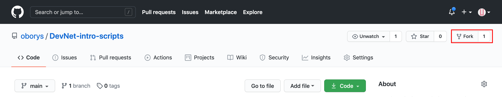
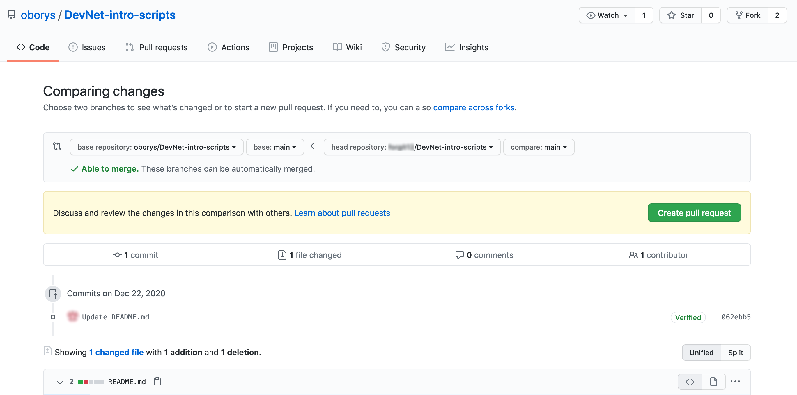

# Git 101

When you see a box that looks like this:

```
Terminal command here
```
You will copy this text and paste it into the terminal. 
For Linux:

### Copy - CTRL+INSERT
### Paste - SHIFT+INSERT

**Repository (a.k.a Repo)** - typically corresponds to a software project, or set of related projects, and controls access for collaborators (e.g. "public" repos visible to the world, or "private" repos accessible only to designated users)

**Cloning** - cloning refers to making a complete copy of a repository, i.e. to your local PC

**Branch** - a version of the main repository, allowing developers to work on updates or new features to the project, without affecting the main (stable/production) version

**Merge** - once work on a branch is complete, the code changes are merged into the main project

**Forking** is a git clone operation executed on a server copy of a projects repo. 


## Your first GitHub Pull request (PR)

### Fork the repo

For example cutent one.
Open link [https://github.com/oborys/DevNet-intro-scripts](https://github.com/oborys/DevNet-intro-scripts) click `Fork` button



Clone the forked repo

```
git clone [URL]
cd DevNet-intro-scripts
```
Forked URL can look like `https://github.com/YOR_GITHUB_USERNAME/DevNet-intro-scripts`

Create new branch
```
git checkout -b mybranch
```
Check if you in the newly created branch
```
git branch -a
```

Open `pull_request` folder
And create file with your Name/Nickname

for example:
```
oborys.txt
```

<details><summary>Second scenario</summary>
<p>

Open `for_pull_request` file
And paste your Name/Nickname in new line

</p>
</details>


Then add the file with the changes
```
git add pull_request/[file_name]
```
Commit file
```
git commit -m 'my commit'
```
push to the branch
```
git push origin mybranch
```

Then return to Github GUI push the "Pull requests" tab at the top of the page 

Click the button "New pull request"


Check the changes and push "Create pull request"

Add extra comments and push "Create pull request"